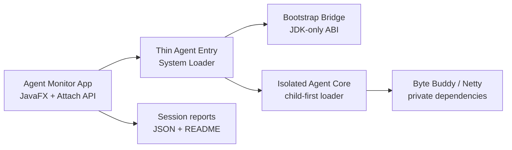

# Agent Monitor

一个面向本机 Java 进程的桌面性能监控工具。它通过 Java Attach API 注入 Agent，对指定业务包的方法、Servlet/HTTP 边界和 JDBC 调用做运行时观测；停止时会请求还原字节码，并生成适合人工和 AI 分析的会话报告。

> 适合本地开发、联调和问题复现。请先在测试环境验证配置，再用于重要服务。

## 5 分钟上手

### 前置条件

- 启动本工具的机器安装 **JDK 17+**，不能只安装 JRE（需要 `jdk.attach`）。
- 被监控进程是本机可 attach 的 Java 进程，建议使用 Java 17+。
- macOS/Linux 上首次 attach 可能需要与目标进程相同的用户权限。

### 构建与启动

开发环境可直接执行 `./start.sh` 启动；如需先关闭已有 Agent Monitor 实例再启动，执行 `./restart.sh`。两个脚本通过根目录的 `agent-monitor.pid` 管理本项目启动的独立进程组：`start.sh` 会拒绝重复启动，并在 Ctrl-C / 终止信号时停止整个受管进程组；`restart.sh` 发现 PID 文件后总会先尝试停止该进程组，确认停止成功才重启。不会停止被监控的目标 JVM。

```bash
./gradlew test
./gradlew :monitor-app:run
```

构建可分发包：

```bash
./gradlew :monitor-app:shadowJar
```

主产物位于 `monitor-app/build/libs/monitor-app-all.jar`。开发时优先使用 Gradle 的 `run` 任务，它会自动带上 JavaFX 和 Attach 所需参数。

如需本机分发目录（macOS/Linux）：

```bash
./gradlew :monitor-app:installDist
./monitor-app/build/install/monitor-app/bin/monitor-app
```

Windows 使用 `monitor-app/build/install/monitor-app/bin/monitor-app.bat`。不建议直接用 `java -jar` 启动 fat JAR，因为 JavaFX/Attach 的运行参数应由应用启动脚本统一提供。

macOS 如需在 Finder 和 Dock 中显示正式应用图标，请构建 `.app` bundle：

```bash
./package-mac.sh
```

产物位于项目根目录的 `app/Agent Monitor.app`。`package-mac.sh` 内部调用
`packageMacApp`，使用 `icon.icns` 生成原生 Finder/Dock 图标；开发时 `./start.sh` 也会使用同一图标。

Windows 请在 Windows 的 Git Bash 中执行：

```bash
./package-win.sh
```

产物位于项目根目录的 `app/Agent Monitor/Agent Monitor.exe`，使用 `icon.ico` 生成资源管理器和任务栏图标。Windows 安装包必须在 Windows 环境中打包，不能从 macOS 交叉生成。

### 使用流程

1. 启动桌面应用，选择目标 JVM。
2. 等待包/类树索引完成，选择需要监控的业务包，例如 `com.example.order`。
3. 按需排除 DTO、Entity、配置类及 getter/setter，并检查右侧 YAML 预览。
4. 确认 YAML 中 `output.exporters` 包含 `netty`，再点击开始；等待状态变为“监控中”。
5. 复现请求或业务场景。
6. 点击停止，等待“字节码已还原”的确认。
7. 打开本次会话目录中的 `reports/performance-report.json` 分析热点和慢链路，并先检查 `captureQuality` 是否存在丢弃或目标端拒绝。

如果停止操作未能确认字节码已还原，**不要立即再次注入**；重启目标服务后再继续，避免残留增强影响判断。

| 停止结果 | 下一步 |
| --- | --- |
| 已确认还原 | 可以开始下一次监控；分析本次 `performance-report.json`。 |
| Collector 未连接或 STOP 超时 | 查看 App 日志和 `agent-logs/agent-monitor.log`；不要假设目标已恢复。 |
| `RESET_FAILED` / 未确认 | 为避免残留 transformer 影响目标进程，重启目标服务后再监控。 |

## 能力边界

| 能力 | 说明 |
| --- | --- |
| 业务方法观测 | 按包名筛选，记录调用树、耗时、异常和可选参数/返回值。 |
| HTTP / Servlet | 识别 `javax.servlet` 与 `jakarta.servlet` 的 Servlet 边界。 |
| JDBC | 观测标准 `Connection` / `Statement` 调用，辅助定位 SQL 相关耗时。 |
| 实时查看 | App 通过本机 Netty Collector 接收 Span。 |
| Netty 断线恢复 | 已成功启动后与同一 Collector 断开时，Agent 在后台退避重连，并重新发送 `HELLO → READY`。 |
| 离线留档 | 可同时写入轮转后的 JSON Span 文件和最终分析报告。 |
| 安全停止 | STOP 指令在字节码还原、Span 导出队列排空并写回最终回执后才确认停止。 |

当前不目标于替代完整 APM：不提供跨进程链路追踪、集中式服务端、长期指标存储或生产级采样治理。

## 架构与类加载隔离



核心约束：

- 传给 `VirtualMachine.loadAgent()` 的外层 JAR 很薄，只含入口和嵌套运行时包。
- Bootstrap 只加载无第三方依赖的 `BootstrapBridge`；Byte Buddy、Netty 和 Agent core 不会进入 Bootstrap/System Loader。
- 被增强的业务字节码只调用 Bridge，Bridge 以 `Object` token 路由到当前 core，避免业务 ClassLoader 依赖 Agent 实现类。
- 每次 attach 都通过 Bridge 串行化：旧 transformer 成功还原后才允许新 core 生效。
- Agent 与内嵌 runtime 使用内容寻址的临时文件，不会覆盖仍被其他目标 JVM 持有的 JAR。

这套结构参考了 Arthas 的“薄入口 + bootstrap spy/bridge + 独立 core ClassLoader”模式。

> 升级提示：Bootstrap 类不能被同一 JVM 替换。已经注入旧版 bridge 的目标 JVM，升级到不兼容 bridge ABI 后需要重启一次目标 JVM。

## 模块说明

| 模块 | 职责 | 主要入口 |
| --- | --- | --- |
| `monitor-app` | JavaFX UI、JVM 列表、Attach、Collector、会话与报告 | `com.agentmonitor.app.MainApp` |
| `monitor-agent` | thin entry、bootstrap bridge、隔离 core、Byte Buddy Advice、Exporter | `AgentBootstrap` / `AgentMain` |
| `monitor-model` | App 与 Agent 共用的协议、Span、配置值对象 | `com.agentmonitor.model.*` |

实际 Agent 产物层级：

| 产物 | 加载位置 | 内容 |
| --- | --- | --- |
| `monitor-agent.jar` | System Loader | 仅 `AgentBootstrap` 与两个嵌套 JAR。 |
| `agent/monitor-bootstrap-bridge.jar` | Bootstrap Loader | JDK-only Bridge 和生命周期 ticket。 |
| `agent/monitor-agent-core.jar` | 私有 child-first loader | Agent core、Byte Buddy、Netty 和 Exporter。 |

## 配置

可从 [sample-agent.yml](monitor-agent/src/main/resources/sample-agent.yml) 导入基础配置。

最常用项：

```yaml
version: 2

scope:
  includePackages:
    - com.example.application
  # 只监控某个类时，可将 includePackages 改为 []，并配置完整 JVM 类名（内部类用 $）。
  includeClasses: []
  excludeConditions:
    - cls:*DTO
    - cls:*Entity
  excludeMethods:
    - get*
    - set*

sampling:
  # 根调用的立即采样比例，范围 0-100；100 表示全部实时导出。
  ratePercent: 10
  # 仅未立即采中的调用：根调用达到该耗时或任一 Span 异常时仍完整保留。
  tailCaptureThresholdMs: 50
  # 尾采样暂存上限；仅影响未命中 ratePercent 的链路。
  tailMaxBufferedSpans: 512
  tailMaxBufferedSizeMb: 1
  # promote（默认）：上限触发后转实时导出；drop：丢弃整条超限链路。
  tailOverflowPolicy: promote

output:
  exporters: [netty, file]
  capture:
    # 个人使用默认完整记录；需要时可单独关闭。
    arguments: true
    returnValue: true
    sqlParameters: true

dependencies:
  jdbc: true
  http: true
```

建议：

- 从一个足够具体的业务包开始，避免把框架、实体和通用工具类纳入。
- `scope.includeClasses` 是精确类白名单：可在 `includePackages: []` 时单独使用，也可与包白名单叠加；仅支持完整 JVM 类名，不支持 `*`，内部类使用 `$`。`includePackages` 与 `includeClasses` 至少需要配置一项。
- `sampling.ratePercent` 以一条根调用为单位决定是否立即记录，业务、HTTP、JDBC 子调用继承同一决定，因此调用树不会残缺。定位单条复杂链路时使用 `ratePercent: 100`，可完全绕开尾采样缓冲。
- 未立即采中的调用会在根调用结束时判断：达到 `tailCaptureThresholdMs` 或任一 Span 抛异常，就完整导出整条链路。它们受 `tailMaxBufferedSpans` 与 `tailMaxBufferedSizeMb` 限制；达到上限时由 `tailOverflowPolicy` 决定转实时导出（默认 `promote`）还是明确丢弃（`drop`）。
- 个人模式默认记录入参、返回值与 SQL 绑定参数；需要减少输出时，可单独关闭 `arguments`、`returnValue` 或 `sqlParameters`。
- 本地排查保留 `netty + file`；file exporter 便于离线复盘。
- Netty 重连只恢复到同一个 Collector 地址和端口。断线窗口采用至多一次投递：Span 不会缓存重放，可能缺少该窗口的数据，但不会因重试产生重复 Span。
- JDBC 和 HTTP 默认开启，也可按配置单独关闭。

## 会话产物与 AI 分析

每次采集创建独立会话目录，默认在：

```text
~/Downloads/agent-monitor-captures/<timestamp>/session-<uuid>/
├── README.md
├── spans/
│   ├── README.md
│   └── spans-*.json
├── reports/
│   ├── README.md
│   ├── slow-spans.json
│   └── performance-report.json
└── agent-logs/
    ├── README.md
    └── agent-monitor.log
```

停止且字节码还原已确认后，界面会弹出本次会话入口：可直接打开会话目录、打开
`reports/performance-report.json`，或复制 AI 分析提示词。若 Agent 已还原字节码但尾部输出
drain 超时，仍可打开这些文件；界面会明确提示报告可能缺少最后一小段数据。

关闭 App 后，可点击界面的“打开历史会话”，选择完整会话目录或其中的 `spans/` 目录，离线重建并
查看调用链。该操作只读取 `spans/spans-*.json`（以及 `.json.gz`）文件，不会连接目标 JVM、启动
Collector 或重新挂载 Agent。

### 可选的本地会话保留

默认**不会自动删除**任何会话。若希望限制本机磁盘占用，可在 `output` 下显式设置：

```yaml
output:
  retention:
    maxSessions: 10
```

`0`（默认）表示关闭清理。开启后，仅在一次成功停止后清理超出数量的旧会话；它只会处理名称和
目录结构均符合本工具生成规则、且已写入最终 `performance-report.json` 的会话，永不删除当前会话、
未完成会话、符号链接或手工目录。

### 给 AI 的最小上下文

将会话目录（或至少以下文件）提供给 AI，并要求它按顺序读取：

1. 根目录 `README.md`：会话状态与文件阅读顺序。
2. `reports/performance-report.json`：最终热点、慢链路、关键路径、错误和 `captureQuality`（Agent 队列/投递丢弃、目标端拒绝、Collector 去重/丢弃）。
3. `reports/slow-spans.json`：运行期间可用的慢方法快照。
4. `agent-logs/agent-monitor.log`：确认哪些类实际被增强，以及是否有 retransformation 失败。
5. 仅在需要证据时读取 `spans/spans-*.json`，它们可能很大且包含敏感参数。

可直接复制这段提示词：

```text
你是 Java 性能分析助手。先阅读会话根目录 README 和 reports/README，
再分析 reports/performance-report.json。请输出：
1. 最值得优先处理的 3 个热点或慢链路；
2. 每项的证据（方法、耗时、调用路径、self time 或关键路径）；
3. 可能根因及需要进一步验证的假设；
4. 风险最低的优化建议。
不要把缺失的报告解释为“没有性能问题”；请检查会话状态、`captureQuality` 与 agent 日志。
```

## 开发导航

| 想修改什么 | 优先查看 |
| --- | --- |
| 注入、重挂、停止、类加载隔离 | `monitor-agent/src/bootstrap/`、`AgentMain.java` |
| 增强哪些类/方法 | `AgentMain.java`、`interceptor/` |
| Span 导出与 STOP 协议 | `exporter/`、`monitor-model/.../protocol/` |
| Attach 与 Agent 文件提取 | `monitor-app/.../service/JvmService.java` |
| 收集、停止确认与 UI 状态 | `monitor-app/.../service/TraceServer.java`、`MainController.java` |
| 会话报告与 AI 文档 | `monitor-app/.../report/` |

## 验证命令

```bash
# 全部单元测试、Agent 真实子 JVM 隔离测试、App 构建
./gradlew test :monitor-app:shadowJar

# 仅验证 Agent 的真实类加载隔离与重复加载
./gradlew :monitor-agent:test --tests com.agentmonitor.agent.integration.AgentClassLoadingIntegrationTest
```

`AgentClassLoadingIntegrationTest` 会启动真实子 JVM，验证：业务 ClassLoader 只看到 Bootstrap Bridge、看不到 Agent core；重复加载不会出现 `LinkageError`。

## 给 AI 编码助手的约束

修改本项目时，请保持以下不变量：

1. 外层 attach JAR 不能包含 `AgentMain`、Byte Buddy、Netty 或其他 core 依赖。
2. Bootstrap Bridge 只能使用 JDK 类型；不要向它引入 App、Agent core 或第三方类型。
3. Advice 是会被内联到业务字节码的薄壳，只能依赖 Bridge，不应引用 core 业务逻辑。
4. STOP 成功的含义是已确认还原字节码；失败时保留旧 runtime 供重试，不能提前关闭其 class loader。
5. 对 Agent/bridge ABI 的不兼容变更必须提高 `BootstrapBridge.apiVersion()`，使已运行 JVM 快速失败而非链接到错误版本。
6. 新增会话文件时，优先原子写入，并在文件旁提供简短 README，避免 AI 读取半成品或误解文件含义。
